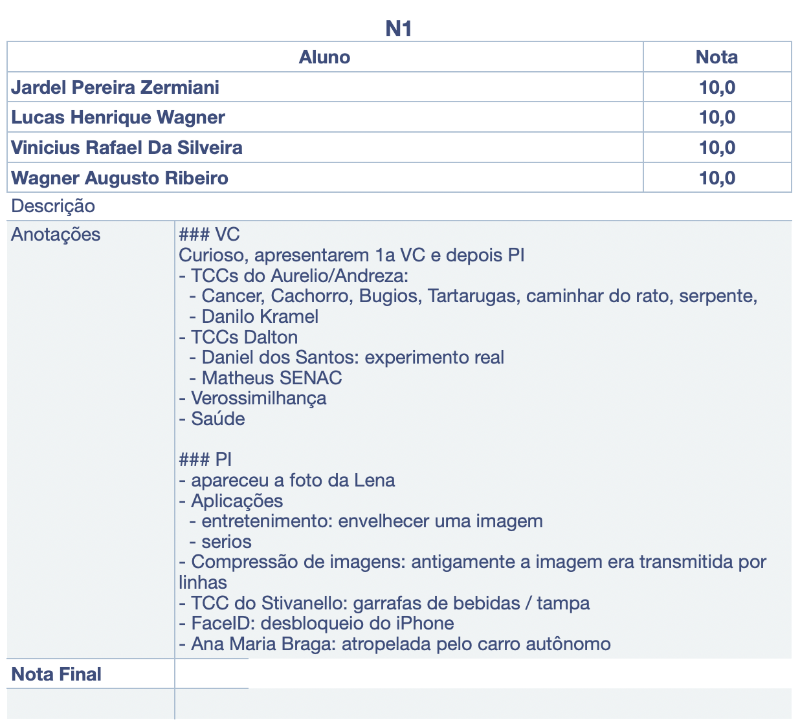

# Equipe

Para desenvolver as atividades da disciplina de Computação Gráfica favor utilizar as respectivas pastas para postar os trabalhos de cada unidade.  

Alunos:  

    Jardel Pereira Zermiani  
    Lucas Henrique Wagner  
    Vinicius Rafael Da Silveira  
    Wagner Augusto Ribeiro  

## [Atividades da Unidade 1](Unidade1/ "Atividades da Unidade 1")  

[Slides](Unidade1/slides.pdf)  
  

## [Atividades da Unidade 2](Unidade2/ "Atividades da Unidade 2")  

## [Atividades da Unidade 3](Unidade3/ "Atividades da Unidade 3")  

## [Atividades da Unidade 4](Unidade4/ "Atividades da Unidade 4")  
